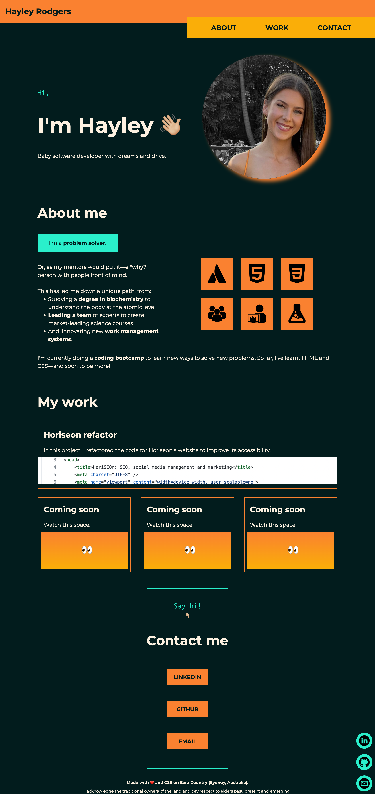

# hayleyrodgers-professional-portfolio

Note: this was my first portfolio. It is outdated as I created a new one on the 30/9/22, which you can find [here](https://github.com/hayleyarodgers/portfolio). That said, I have chosen to keep this repository public because it represents an important milestone in my coding career—I am particularly proud of how I achieved this using *only* HTML and CSS after only a couple of weeks of learning to code.

## Description

My goal for this project was to create a personal portfolio to collate samples of my work. This is to showcase my skills and experience to prospective employers so they can determine whether I might be a good fit for their company.

To achieve this, I used HTML and CSS.

During this project, I consolidated my understanding of HTML and CSS. In particular, I re-inforced what I have learnt about:
- CSS variables
- The box model and flexbox
- Media queries
- Commenting on HTML and CSS
- Wireframes
- VS Code
- Terminal
- And, GitHub.

## Access

To access the live application via Github Pages, click [here](https://hayleyarodgers.github.io/hayleyrodgers-professional-portfolio/). 

To access the repository where the code I refactored is saved, click [here](https://github.com/hayleyarodgers/hayleyrodgers-professional-portfolio).

## Credits

- I used [this tutorial from GoogleFonts](https://developers.google.com/fonts/docs/getting_started) to use different fonts.
- I used [this guide from Canva](https://www.canva.com/learn/100-color-combinations/) to give me color inspiration.
- I looked at the following portfolios for inspiration:
  - [Brittany Chiang](https://brittanychiang.com/)
  - [Matt Farley](https://mattfarley.ca/)
  - [Olaolu](https://olaolu.dev/)
  - [Jacek Jeznach](https://jacekjeznach.com/)
  - [Annie Bombanie](https://anniebombanie.com/)
